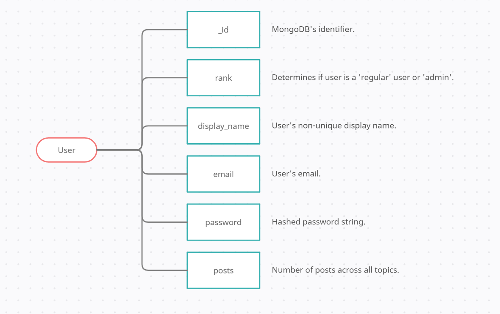
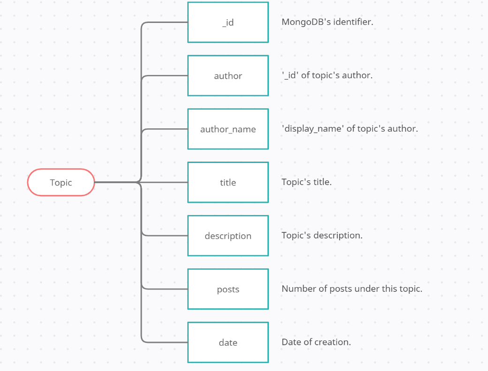

# Virtual Parlay

## User Experience (UX)

---

-   ### User stories

    -   #### As an user I need to:

        - Be able to register, log in and log out.
        - Be able to open a new topic so I can discuss a game with other users.
        - Be able to modify and delete my own topics and posts.
        - Be able to look at other user's profiles.
        - Be able to modify my own profile.
        

    -   #### As an admin I need to:

        - Be able to log in and log out.
        - Be able to open a new topic so I can discuss a game with other users.
        - Be able to modify and delete any user's topics and posts.
        - Be able to look at and modify any user's profiles.

-   ### Design
    -   #### Colour Scheme
        The main colours used throughout the page are: 
        -   **#B1F4FC:** For the background gradient.
        -   **#01173f:** For the background gradient.
        -   **#395461:** For the navbar 
        -   **#f8f8ff:** For most of the card panels.
        -   **#449FAF:** For posts speech bubbles.
        -   **Dark Wood:** For most of the buttons. 

        The following colour palette was chosen as the inspiration for the base colours picked:
        

-   ### Typography
    -   Two main fonts were chosen for this page: 
        -   **"Berkshire Swash"** for the logo's text and titles throughout the project with **"cursive"** as fallback, giving the page a stylish and regal feel, imitating royal decrees in pirate's times.
        -   **"Merienda"** for the rest of the text, with **"cursive"** as fallback, granting an ink pen look that isn't tiring to read.

    ### Imagery
    -   **Logo**: A skull with swords was chosen as the logo to represent a Jolly Roger characteristic of pirate ships.
    -   **Waves**: Animated waves in the background of all pages were added to present a dynamic element that would add depth to the pirate theme, yet remain soothing enough to not disrupt page navigation and functionality.
    -   **Default Profile Image**: A pirate captain was chosen to introduce users as pirates to the community, leaving the theme as the first impression.

*   ### Wireframes

    -   Mobile Wireframe - [View](https://github.com/JuanBrachoDev/Virtual-Parlay/tree/master/docs/readme/wireframes/mobile)

    -   Desktop Wireframe - [View](https://github.com/JuanBrachoDev/Virtual-Parlay/tree/master/docs/readme/wireframes/desktop)

## Database

---

Three different collections were used throughout this project, the database service used was MongoDB Atlas, which is  document-based (NoSQL).

-   ### General Schema:
   

-   ### User Schema:
   

-   ### Topic Schema:
   

-   ### Post Schema:
   

## Features

---

-   ### Index
       Shows all topics to users, with information like topic's, title, description, creator, number of posts under the topic and creation date.
-   ### Search topics
       Navbar includes search functionality for topics, implemented with a text index from MongoDB.
-   ### Create new topic
       Lets any user to create a new topic to be discussed with other users.
-   ### Discussion
       Allows user to post messages under a specific topic, enabling quick and easy communication between all interested users. Also allows owners and admins to edit/delete their own topics and posts.
-   ### Profile
       Provides users with a personal, customizable space for their accounts.
-   ### Register
       Enables users to create an account so they are able to log in, create topics and participate in discussions.
-   ### Log In / Log Out
       Allows users to sign in and out of their accounts.

## Future Features

---

-   ### Recover account
    Implement a forgotten password view that allows users to recover their accounts by following a link sent to their respective email.

-   ### TapHold Event for Mobiles
    Replace the menu button for editing and deleting posts with a tap hold event that triggers the menu for small devices.

-   ### Post count removal on topic deletion.
    Post count for users is only subtracted from deleted posts, a function will be created so upon topic deletion it scans all posts associated, deletes those posts and adjusts posts count for all users involved.

## Technologies Used

---

### Languages Used

-   [HTML5](https://en.wikipedia.org/wiki/HTML5)
-   [CSS3](https://en.wikipedia.org/wiki/Cascading_Style_Sheets)
-   [JavaScript](https://en.wikipedia.org/wiki/JavaScript)
-   [Python](https://en.wikipedia.org/wiki/Python_(programming_language))

### Frameworks, Libraries & Programs Used

1. [MaterializeCSS 1.0.0:](https://materializecss.com/getting-started.html)
    - Bootstrap was used to assist with the responsiveness and styling of the website.
1. [Chrome DevTools:](https://developers.google.com/web/tools/chrome-devtools)
    - Chrome's DevTools were used throughout the project to test the layout and make the necessary adjustments.
1. [Google Fonts:](https://fonts.google.com/)
    - Google fonts were used to import the 'Berkshire Swash' and 'Merienda' fonts.
1. [Font Awesome:](https://fontawesome.com/)
    - Font Awesome was used to add icons like the ones used in the add/remove buttons, and the tutorial floating action button.
1. [Game-Icons:](https://game-icons.net/)
    - Tool used to create the page logo and default profile image.
1. [jQuery:](https://jquery.com/)
    - jQuery was used to enhance JavaScript code, providing useful methods and selectors to it.
1. [Git:](https://git-scm.com/)
    - Git was used for version control by utilizing the Gitpod terminal to commit to Git and Push to GitHub.
1. [GitHub:](https://github.com/)
    - GitHub is used to store the project's code after being pushed from Git.
1. [RandomKeygen:](https://randomkeygen.com/)
    - Used to generate the secret key for the env file.
1. [Heroku:](https://www.heroku.com/home)
    - Heroku was the platform used to deploy the application from the GitHub repository
1. [MongoDB:](https://www.mongodb.com/)
    - MongoDB was the document-based database service used.
1. [Balsamiq:](https://balsamiq.com/)
    - Balsamiq was used to create the [Mobile](https://github.com/JuanBrachoDev/Virtual-Parlay/tree/master/docs/wireframes/mobile) and [Desktop](https://github.com/JuanBrachoDev/Virtual-Parlay/tree/master/docs/wireframes/desktop) wireframes during the design process.
1. [Creately:](https://app.creately.com/)
    - Editor used to create schema images for readme file.
1. [Am I responsive:](http://ami.responsivedesign.is/)
    - Used to efficiently test different responsive layouts and provide the header image in the readme file.
1. [Dillinger:](http://dillinger.io/)
    - Markdown editor used to create the readme file.

## Testing

---
You can access the testing document by clicking [Here](https://github.com/JuanBrachoDev/Virtual-Parlay/tree/master/docs/readme/TESTING.md).

## Deployment

---

### Deployment to Heroku

The project was deployed to [Heroku](https://www.heroku.com/home) by automatically deploying from [GitHub](https://github.com/) using the following steps:

> This guide assumes you already have a [GitHub](https://github.com/) repo that contains an ``env.py`` file that stores your environment's custom settings.

1. Set up the ``requirements.txt`` and ``Procfile`` by using the following commands in the terminal:

            $ pip3 freeze --local > requirements.txt
            $ echo web: python app.py > Procfile
1. Push the code to [GitHub](https://github.com/) so the repo contains these newly added files.
1. Log in to [Heroku](https://www.heroku.com/home), (or Register if needed).
1. Click on "New" in the dashboard and select "Create new app".
1. Enter "App name" and select the region closest to you, (Europe was selected for this project).
1. Within the app dashboard select the "Deploy" menu and click on the "Connect to GitHub" button.
1. Search for the desired repo within your [GitHub](https://github.com/) profile and click "Connect".
1. Click on "Settings" in the app dashboard and select "Reveal Config Vars".
1. Input all environment variables found in your ``env.py`` file.
1. Go back to the "Deploy" tab and select "Enable Automatic Deploys".
1. Below the automatic deployment section select the master branch and click on "Deploy Branch".
1. Wait for [Heroku](https://www.heroku.com/home) to finish the deployment and finally click on "View" to access the deployed app.

## Credits

---

### Code

-   [Materialize CSS](https://getbootstrap.com/docs/4.4/getting-started/introduction/): Library used throughout the project to make the site visually appealing and responsive.
-   [Markdown Guide](https://www.markdownguide.org/): As a guide to create the readme file.
-   [Coding is Love](https://codingislove.com/css-speech-bubbles/): Code for speech bubbles found in 'discussion' view.
-   [Codepen](https://codepen.io/plavookac/pen/QMwObb): Code for waves implemented across all templates.
-   [Code Institute](https://codeinstitute.net/): As a general point of reference.
-   [Stack Overflow](https://stackoverflow.com/): As a general point of reference.
-   [W3Schools](https://www.w3schools.com/): As a general point of reference.

### Content

-   [Reddit](https://www.reddit.com/): As reference for concept and layout.

### Media

-   Dark Wood Image: “Dark Wood” (c) by Omar Alvarado is licensed under (CC BY-SA 3.0), content found in [Toptal.com](https://www.toptal.com/designers/subtlepatterns/dark-wood/).
-   Default Image, Logo Image: “56 Pirate icons” (c) by Game-Icons.net is licensed under (CC BY 3.0), content found in [Game-icons.net](https://game-icons.net/tags/pirate.html).

### Acknowledgements

-   My Mentor Narender for continuous helpful feedback.
-   Code Institute's tutor support for their helpful input.