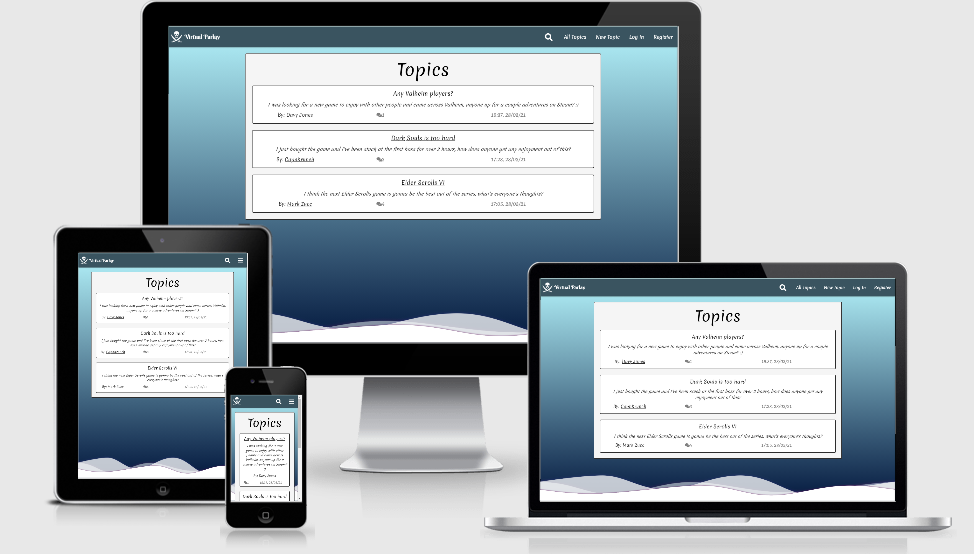
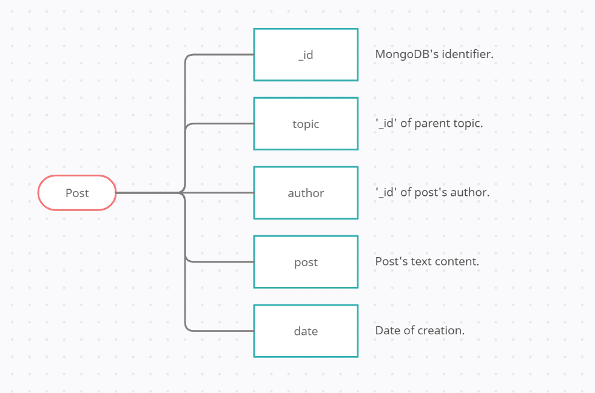

# Virtual Parlay

## User Experience (UX)

---

-   ### User stories

    -   #### As an user I need to:

        - Be able to open a new topic so I can discuss a game with other users.
        - Be able to modify and delete my own topics and posts.
        - Be able to look at other user's profiles.
        - Be able to modify my own profile.
        - Be able to register, log in and recover my password in case I lose it.

    -   #### As an admin I need to:
    
        - Be able to open a new topic so I can discuss a game with other users.
        - Be able to modify and delete any user's topics and posts.
        - Be able to look at and modify any user's profiles.
        - Be able to log in and recover my password in case I lose it.

-   ### Design
    -   #### Colour Scheme
        The main colours used throughout the page are: 
        -    **#B1F4FC:** For the background.
        -    **#395461:** For the navbar 
        -    **Light Wood:** For most of the card panels.
        -    **Dark Wood:** For most of the buttons. 

-   ### Typography
    -   Two main fonts were chosen for this page: 
        -   **"Berkshire Swash"** for the logo's text and titles throughout the project with **"cursive"** as fallback, giving the page a stylish and regal feel, imitating royal decrees in pirate's times.
        -   **"Merienda"** for the rest of the text, with **"cursive"** as fallback, granting an ink pen look that isn't tiring to read.
        
-   ### Imagery
    ##################################################################################################################################

*   ### Wireframes

    -   Mobile Wireframe - [View](https://github.com/JuanBrachoDev/Virtual-Parlay/tree/master/docs/readme/wireframes/mobile)

    -   Desktop Wireframe - [View](https://github.com/JuanBrachoDev/Virtual-Parlay/tree/master/docs/readme/wireframes/desktop)

## Database

---

Three different collections were used throughout this project, the database service used was MongoDB Atlas, which is  document-based (NoSQL).

-   ### General Schema:
   

-   ### User Schema:
   

-   ### Topic Schema:
   

-   ### Post Schema:
   

## Features

---

-   ### Placeholder
       Placeholder

## Technologies Used

---

### Languages Used

-   [HTML5](https://en.wikipedia.org/wiki/HTML5)
-   [CSS3](https://en.wikipedia.org/wiki/Cascading_Style_Sheets)
-   [JavaScript](https://en.wikipedia.org/wiki/JavaScript)
-   [Python](https://en.wikipedia.org/wiki/Python_(programming_language))

### Frameworks, Libraries & Programs Used

1. [MaterializeCSS 1.0.0:](https://materializecss.com/getting-started.html)
    - Bootstrap was used to assist with the responsiveness and styling of the website.
1. [Chrome DevTools:](https://developers.google.com/web/tools/chrome-devtools)
    - Chrome's DevTools were used throughout the project to test the layout and make the necessary adjustments.
1. [Google Fonts:](https://fonts.google.com/)
    - Google fonts were used to import the 'Berkshire Swash' and 'Merienda' fonts.
1. [Font Awesome:](https://fontawesome.com/)
    - Font Awesome was used to add icons like the ones used in the add/remove buttons, and the tutorial floating action button.
1. [Game-Icons:](https://game-icons.net/)
    - Tool used to create the page logo and default profile image.
1. [jQuery:](https://jquery.com/)
    - jQuery was used to enhance JavaScript code, providing useful methods and selectors to it.
1. [Git:](https://git-scm.com/)
    - Git was used for version control by utilizing the Gitpod terminal to commit to Git and Push to GitHub.
1. [GitHub:](https://github.com/)
    - GitHub is used to store the project's code after being pushed from Git.
1. [Heroku:](https://www.heroku.com/home)
    - Heroku was the platform used to deploy the application from the GitHub repository
1. [MongoDB:](https://www.mongodb.com/)
    - MongoDB was the document-based database service used.
1. [Balsamiq:](https://balsamiq.com/)
    - Balsamiq was used to create the [Mobile](https://github.com/JuanBrachoDev/Virtual-Parlay/tree/master/docs/readme/wireframes/mobile) and [Desktop](https://github.com/JuanBrachoDev/Virtual-Parlay/tree/master/docs/readme/wireframes/desktop) wireframes during the design process.
1. [Am I responsive:](http://ami.responsivedesign.is/)
    - Used to efficiently test different responsive layouts and provide the header image in the readme file.
1. [Dillinger:](http://dillinger.io/)
    - Markdown editor used to create the readme file.

## Testing

---
You can access the testing document by clicking [Here](https://github.com/JuanBrachoDev/Virtual-Parlay/tree/master/docs/readme/testing.md).

## Deployment

---

### GitHub Pages

The project was deployed to Heroku using the following steps...

## Credits

---

### Code

-   [Materialize CSS](https://getbootstrap.com/docs/4.4/getting-started/introduction/): Library used throughout the project to make the site visually appealing and responsive.
-   [Markdown Guide](https://www.markdownguide.org/): As a guide to create the readme file.
-   [Coding is Love](https://codingislove.com/css-speech-bubbles/): Code for speech bubbles found in 'discussion' view.
-   [Codepen](https://codepen.io/plavookac/pen/QMwObb): Code for waves implemented across all templates.
-   [Code Institute](https://codeinstitute.net/): As a general point of reference.
-   [Stack Overflow](https://stackoverflow.com/): As a general point of reference.
-   [W3Schools](https://www.w3schools.com/): As a general point of reference.

### Content

-   Placeholder

### Media

-   Squares with colour hexcode for README: Courtesy of [Placeholder.com](https://placeholder.com/). 
-   Wood Pattern Image: “Wood Pattern” (c) by Alexey Usoltsev is licensed under (CC BY-SA 3.0), content found in [Toptal.com](https://www.toptal.com/designers/subtlepatterns/wood-pattern/).
-   Dark Wood Image: “Dark Wood” (c) by Omar Alvarado is licensed under (CC BY-SA 3.0), content found in [Toptal.com](https://www.toptal.com/designers/subtlepatterns/dark-wood/).
-   Default Image, Logo Image: “56 Pirate icons” (c) by Game-Icons.net is licensed under (CC BY 3.0), content found in [Game-icons.net](https://game-icons.net/tags/pirate.html).

### Acknowledgements

-   My Mentor Narender for continuous helpful feedback.